# Laporan Projek Machine Learning
### Nama: Asyfa Nabilla Rahmi
### NIM: 211351033
### Kelas: Pagi A

# Domain Projek
Apple Stock Prices (AAPL) dari tahun 2015-2020 di USA adalah data historis yang mencatat pergerakan harga saham di perusahaan Apple Inc.
Data seperti ini sangat berguna untuk analisis keuangan, perdagangan saham, dan pemodelan keuangan.

## Business Understanding
Data Apple Stock Price berguna di dalam dunia keuangan dan investasi, banyak analis dan investor menggunakannya untuk mengambil keputusan berdasarkan informasi historis tentang perusahaan dan pasar.

### Problem Statement
- Data harga saham Apple sering kali tersedia dalam berbagai tingkat interval waktu, seperti harian (daily), mingguan (weekly), bulanan (monthly), dan intraday, yang memungkinkan analis untuk memeriksa perubahan harga saham di tingkat yang berbeda.
- Data ini mencakup informasi harga saham, termasuk harga pembukaan (open), harga penutupan (close), harga tertinggi (high), harga terendah (low), volume perdagangan, dan harga penutupan yang disesuaikan (adjusted close).

### Goals
- Mengidentifikasi harga saham Apple
- Investasi jangka panjang
- Data harga saham membantu dalam pemahaman pasar secara keseluruhan

    ## Solution Statement
    - Analis menggunakan data harga saham harian untuk memplot grafik harga saham Apple, menerapkan analisis teknikal, seperti moving averages, dan mengidentifikasi tren harga saham.
    - Investor mengumpulkan data harga saham bulanan Apple selama beberapa tahun terakhir dan menganalisis kinerja saham selama jangka waktu yang lama. Menilai faktor-faktor fundamental, seperti pendapatan dan laba bersih. Dengan informasi ini, investor dapat membuat keputusan investasi jangka panjang yang lebih terarah.

## Data Understanding
Dataset Apple Stock Price (2015-2020) berisi tentang data harga saham Apple di USA. Dataset diambil dari kaggle dan bisa diakses di link berikut
 [Apple-Stock-Prices-2015-2020] 
 https://www.kaggle.com/datasets/suyashlakhani/apple-stock-prices-20152020

### Variabel pada Apple Stock Price (2015-2020) dataset
- Symbol (object) = Apple stock
- Close (float(64)) = Harga penutupan
- High (float(64)) = Harga tertinggi
- Low (float(64)) = Harga terendah
- Open (float(64)) = Harga pembukaan
- Volume (int(64)) = Volume perdagangan
- AdjClose (float(64)) = Harga penutupan yang disesuaikan
- AdjHigh (float(64)) = Harga tertinggi yang disesuaikan
- AdjOpen (float(64)) = Harga pembukaan yang disesuaikan
- AdjVolume (int(64)) = Volume perdagangan yang disesuaikan
- DivCash (float(64)) = Cash dividend
- SplitFactor (float(64)) = Stock split

## Data Preparation
Data yang diambil didapatkan dari kaggle dengan judul Apple Stock Prices (2015-2020) dan link yang bisa diakses sama seperti di atas.

### Data Discovery and Profiling
Pertama-tama kita harus menghubungkan google colab dengan kaggle
```python
from google.colab import files
files.upload()
```

Kita buat direktori dan izin (permission) menggunakan script di bawah.
```python
!mkdir -p ~/.kaggle
!cp kaggle.json ~/.kaggle/
!chmod 600 ~/.kaggle/kaggle.json
!ls ~/.kaggle
```

Tahap ini kita coba untuk memanggil URL dataset yang kita gunakan, dataset diambil dari kaggle, yaaa...
```python
!kaggle datasets download -d suyashlakhani/apple-stock-prices-20152020
```

Selanjutnya jangan lupa ekstrak dataset yang sudah didownload dengan script di bawah.
```python
!mkdir apple-stock-prices-20152020
!unzip apple-stock-prices-20152020.zip -d apple-stock-prices-20152020
!ls apple-stock-prices-20152020
```

Lalu kita deklarasikan library yang akan kita gunakan.
```python
import matplotlib.pyplot as plt
import numpy as np
import pandas as pd
import seaborn as sns
from sklearn.model_selection import train_test_split
from sklearn.linear_model import LinearRegression
```

Di tahap ini kita coba untuk memanggil dataset dan menampilkan isi dari datasetnya.
```python
df = pd.read_csv('apple-stock-prices-20152020/AAPL.csv')
df.head()
```
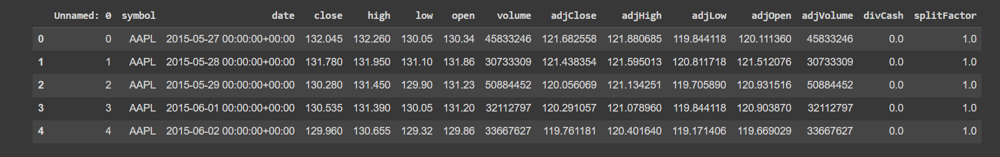

```python
df.info()
```
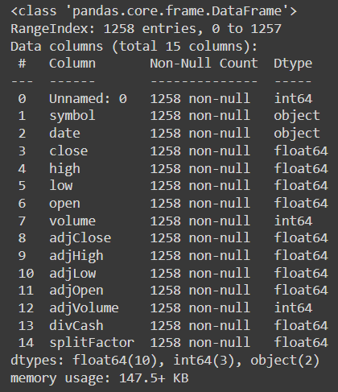

Kita cek heatmap untuk melihat data yang kosong, yuk!
```python
sns.heatmap(df.isnull())
```
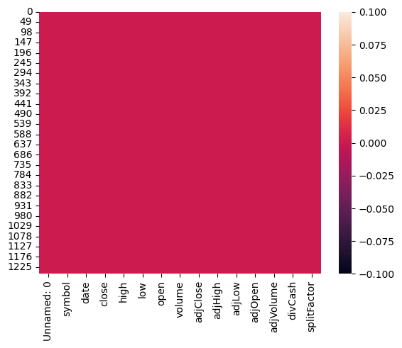

Berikutnya kita langsung cek detail dari datasetnya dengan script di bawah ini.
```python
df.describe()
```
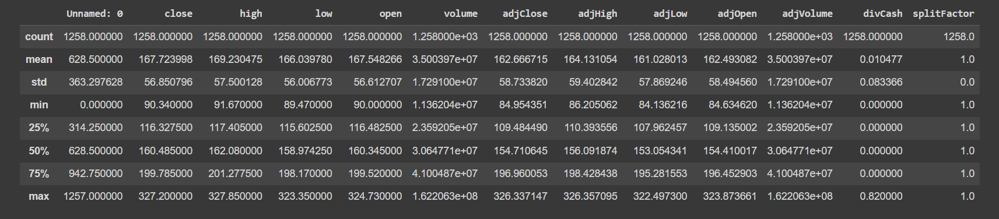

Selanjutnya kita visualisasikan heatmapnya...
```python
plt.figure(figsize=(10,8))
sns.heatmap(df.corr(),annot=True)
```
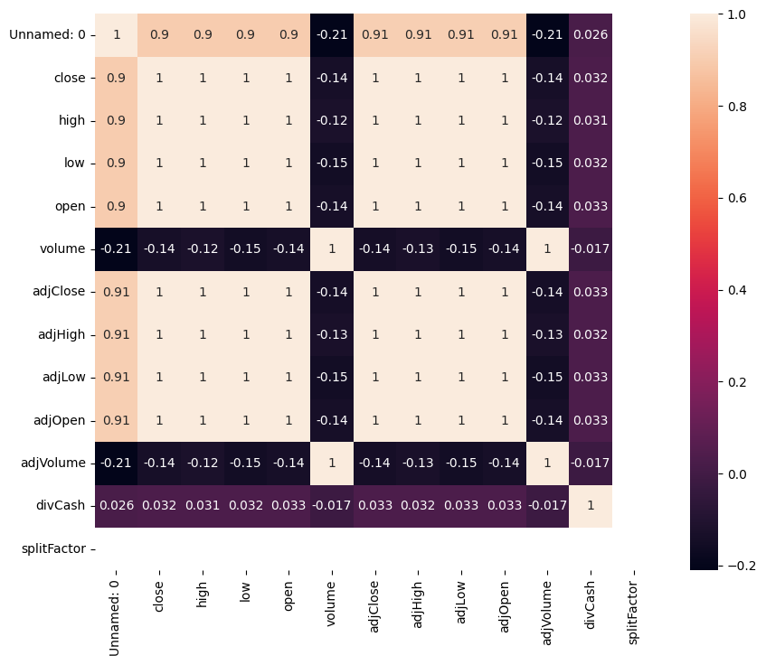

Kita tampilkan harga pembukaannya
```python
models = df.groupby('symbol').count()[['open']].sort_values(by='open', ascending=True).reset_index()
```
```python
fig = plt.figure(figsize=(15,5))
sns.barplot(x=models['symbol'], y=models['open'], color='yellow')
plt.xticks(rotation=60)
```
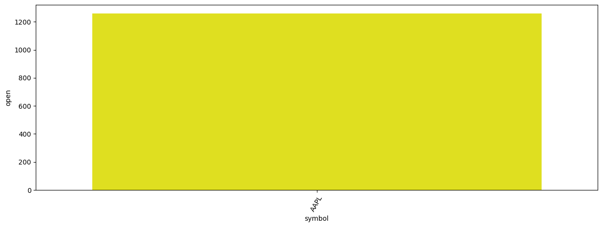

Daann... ini adalah informasi harga penutupannya
```python
Id = df.groupby('symbol').count()[['close']].sort_values(by='close').reset_index()
```
```python
plt.figure(figsize=(15,5))
sns.barplot(x=Id['symbol'], y=Id['close'], color='yellow')
```
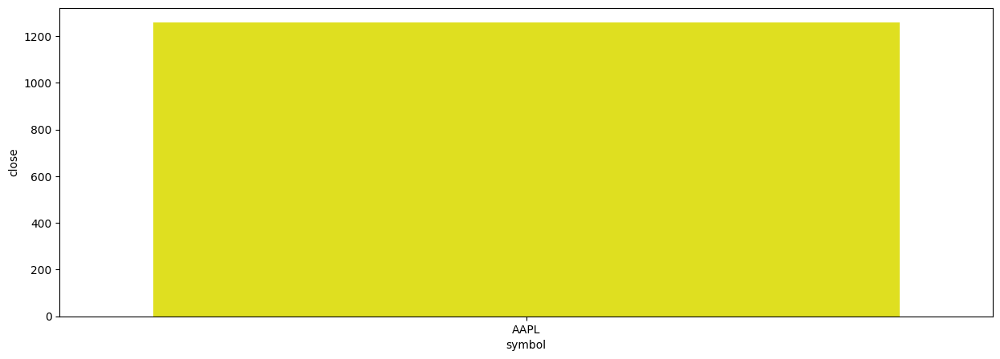

Selanjutnya di sini kita akan menampilkan distribusi harga tertinggi dan harga terendahnya.
```python
plt.figure(figsize=(15,5))
sns.distplot(df['high'])
```


```python
plt.figure(figsize=(15,5))
sns.distplot(df['low'])
```
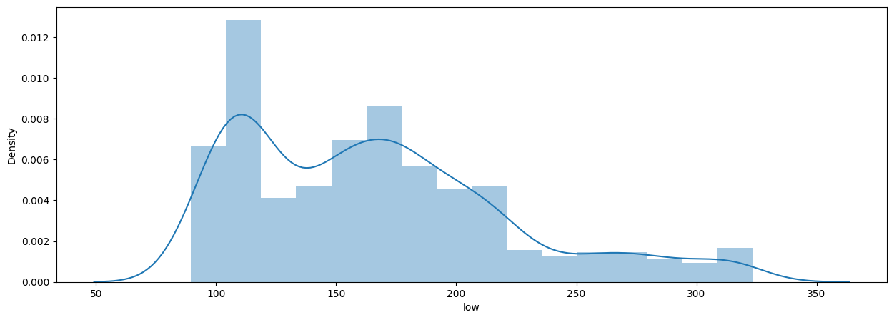

## Modeling
Setelah melakukan analisis data, kita lanjut ke modeling.. karena sebelumnya kita sudah import library di atas maka selanjutnya kita akan langsung memilih atribut mana saja yang akan dijadikan label.
```python
features = ['close', 'low', 'open', 'volume', 'adjClose', 'adjLow', 'adjOpen', 'adjVolume']
x = df[features]
y = df['high']
print("Shape of x:", x.shape)
print("Shape of y:", y.shape)
```
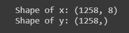

Kita lakukan split data di sini, yaaa... scriptnya seperti di bawah ini.
```python
x_train, x_test, y_train, y_test = train_test_split(x,y,random_state=70)
y_test.shape
```
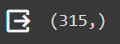

Selanjutnya kita masukan data training dan testing ke dalam model regresi linier.
```python
lr = LinearRegression()
lr.fit(x_train, y_train)
pred = lr.predict(x_test)
```

Di tahap ini kita menampilkan tingkat akurasinya.
```python
score = lr.score(x_test, y_test)
print('akurasi model regresi linier = ', score)
```
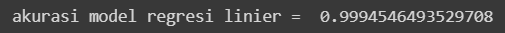

Dan di sini kita coba model estimasi menggunakan regresi linier ini dengan memasukan inputan data terbaru.
```python
input_data = np.array([[132.045, 130.05, 130.34, 45833246, 121.682558, 119.844118, 120.111360, 45833246]])

prediction = lr.predict(input_data)
print('estimasi apple stock :', prediction)
```
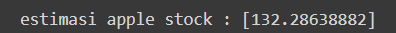

### Save Model
Selanjutnya simpan model menggunakan pickle!
```python
import pickle

filename = 'estimasi_apple.sav'
pickle.dump(lr, open(filename,'wb'))
```
## Evaluation
Dalam kasus ini saya menggunakan R-squared sebagai metrik evaluasi
Fungsi r2_score dari scikit-learn digunakan untuk menghitung R-squared. Nilai R-squared akan memberi tahu sejauh mana model regresi Anda menjelaskan variasi dalam data harga saham aktual. Nilai R-squared berkisar antara 0 dan 1, dan semakin mendekati 1, semakin baik model Anda dalam menjelaskan data.
```python
from sklearn.metrics import r2_score
```

```python
y_true = ([132.045, 130.05, 130.34, 45833246, 121.682558, 119.844118, 120.111360, 45833246]) 
y_pred = ([131.780, 131.10, 131.86, 30733309, 121.438354, 120.811718, 121.512076, 30733309])  
```

```python
r_squared = r2_score(y_true, y_pred)
print("R-squared (R²):", r_squared)
```
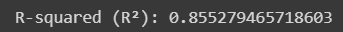

## Deployment
https://appapplestockprice20152020-p97yv9qscttbf4zjeqb6fd.streamlit.app/
