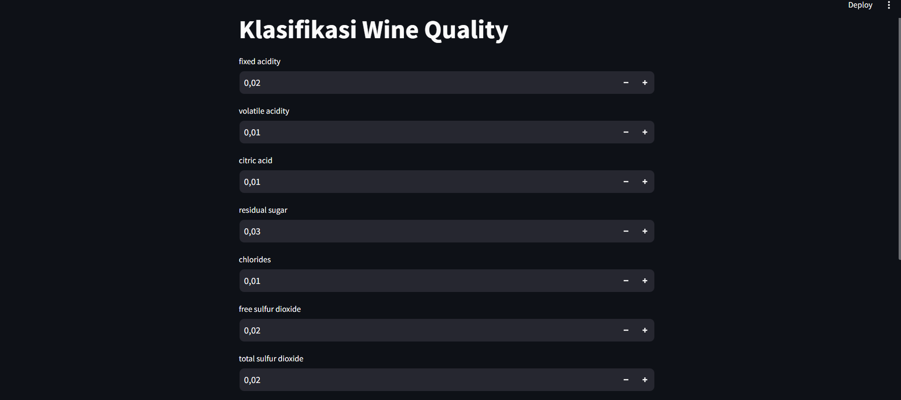

# Laporan Projek Machine Learning
### Nama: Asyfa Nabilla Rahmi
### NIM: 211351033
### Kelas: Pagi A

# Domain Projek
Wine Quality Dataset ini menjelaskan jumlah berbagai bahan kimia yang ada dalam anggur (wine) dan pengaruhnya terdahap kualitas. Dataset ini dapat dilihat sebagai tugas klasifikasi dan regresi. 

## Business Understanding
Dataset ini dapat digunakan untuk melihat jumlah bahan kimia yang dikandung dalam anggur (wine) dan pengaruh terhadap kualitasnya. 

### Problem Statement
Bagaimana kita dapat dengan efisien dan akurat menentukan jumlah bahan kimia yang terkandung dalam anggur (wine) untuk memahami dan mengendalikan faktor-faktor yang memengaruhi kualitas, rasa, dan keamanan produk ini, serta memenuhi persyaratan peraturan yang berlaku.

### Goals
Mengembangkan metode analisis yang cepat dan akurat untuk mengukur jumlah bahan kimia yang terkandung dalam wine, termasuk senyawa seperti alkohol, asam tartarat, gula, dan lainnya.

## Solution Statement
Mengembangkan metode analisis kimia yang akurat dan cepat untuk mengukur berbagai senyawa dalam wine, seperti kromatografi, spektroskopi, dan teknik sensorik yang dapat memberikan hasil yang dapat diandalkan.

## Data Understanding
Wine Quality Dataset ini menjelaskan jumlah berbagai bahan kimia yang ada dalam anggur (wine) dan pengaruhnya terdahap kualitas. Dataset diambil dari kaggle dan bisa diakses di link berikut
 [Wine Quality Dataset] 
 https://www.kaggle.com/datasets/yasserh/wine-quality-dataset/data

### Variabel pada Apple Stock Price (2015-2020) dataset
- Fixed acidity: Keasaman tetap, tingkat keasaman non-volatile (keasaman yang tidak menguap) dalam suatu larutan asam.
- Volatile acidity: Keasaman volatil, keasaman yang dapat menguap dan memengaruhi aroma wine.
- Citric acid: Asam sitrat, jenis asam organik dalam wine yang berperan dalam memberikan karakteristik rasa.
- Residual sugar: Gula sisa, jumlah gula yang tersisa dalam wine setelah fermentasi, memengaruhi tingkat kekeringan atau manisnya wine.
- Chlorides: Klorida, kandungan ion klorin dalam wine yang mempengaruhi rasa dan stabilitas wine.
- Free sulfur dioxide: Sulfur dioksida bebas
- Total sulfur dioxide: Total sulfur dioksida
- Density: Kepadatan, berat spesifik wine yang mempengaruhi kadar alkohol dan potensi gula dalam wine.
- pH: Mengukur tingkat keasaman atau kebasaan dalam wine
- Sulphates: Sulfat, berasal dari campuran sulfat dalam proses pembuatan wine, berperan dalam perlindungan terhadap mikroorganisme.
- Alcohol: Kadar alkohol etil dalam wine, memengaruhi rasa, kehangatan, dan kesan umum wine.
- Quality (score between 0 and 10)

## Data Preparation
Data yang diambil didapatkan dari kaggle dengan judul Wine Quality Prediction dan link yang bisa diakses sama seperti di atas.

### Data Discovery and Profiling
Pertama-tama kita harus menghubungkan google colab dengan kaggle
```python
from google.colab import files
files.upload()
```

Kita buat direktori dan izin (permission) menggunakan script di bawah.
```python
!mkdir -p ~/.kaggle
!cp kaggle.json ~/.kaggle/
!chmod 600 ~/.kaggle/kaggle.json
!ls ~/.kaggle
```

Tahap ini kita coba untuk memanggil URL dataset yang kita gunakan, dataset diambil dari kaggle, yaaa...
```python
!kaggle datasets download -d yasserh/wine-quality-dataset
```

Selanjutnya jangan lupa ekstrak dataset yang sudah didownload dengan script di bawah.
```python
!mkdir wine-quality-dataset
!unzip wine-quality-dataset.zip -d wine-quality-dataset
!ls wine-quality-dataset
```

Lalu kita deklarasikan library yang akan kita gunakan.
```python
import matplotlib.pyplot as plt
import numpy as np
import pandas as pd
import seaborn as sns
```

Di tahap ini kita coba untuk memanggil dataset dan menampilkan isi dari datasetnya.
```python
df = pd.read_csv('wine-quality-dataset/WineQT.csv')
df.head()
```


```python
df.info()
```

Kita cek heatmap untuk melihat data yang kosong, yuk!
```python
sns.heatmap(df.isnull())
```


Berikutnya kita langsung cek detail dari datasetnya dengan script di bawah ini.
```python
df.describe()
```

Selanjutnya kita visualisasikan EDAnya....
```python
plt.figure(figsize=(10,8))
sns.heatmap(df.corr(),annot=True)
```


```python
df.hist(figsize=(20,15))
plt.show()
```


```python
sns.catplot(x="quality",data=df,kind="count")
```


```python
plot = plt.figure(figsize=(5,5))
sns.barplot(x="quality",y="volatile acidity",data=df)
```


```python
plot = plt.figure(figsize=(5,5))
sns.barplot(x="quality",y="citric acid",data=df)
```


```python
plot = plt.figure(figsize=(5,5))
sns.barplot(x="quality",y="residual sugar",data=df)
```


```python
plt.figure(figsize=(15,5))
sns.distplot(df['alcohol'])
```


```python
plt.figure(figsize=(15,5))
sns.distplot(df['quality'])
```


## Modeling
Setelah melakukan analisis data, kita lanjut ke modeling.. selanjutnya kita akan langsung memilih atribut mana saja yang akan dijadikan label.
```python
features = ['fixed acidity', 'volatile acidity', 'citric acid', 'residual sugar', 'chlorides', 'free sulfur dioxide', 'total sulfur dioxide', 'pH', 'sulphates', 'alcohol']
x = df[features]
y = df['quality']
print("Shape of x:", x.shape)
print("Shape of y:", y.shape)
```


Jangan lupa untuk memanggil library yang kita butuhkan di modeling ini.
```python
from sklearn.linear_model import LogisticRegression
from sklearn.preprocessing import MinMaxScaler
```

```python
X=df.drop('quality',axis=1)
Y=df['quality'].apply(lambda y_value:1 if y_value>=5 else 0)
xtrain, xtest, ytrain, ytest = train_test_split(X, Y, test_size=0.2, random_state=70)
xtrain.shape,xtest.shape
```

```python
norm=MinMaxScaler()
xtrain=norm.fit_transform(xtrain)
xtest=norm.transform(xtest)
```


```python
model=LogisticRegression(max_iter=5000)
```

```python
model.fit(xtrain,ytrain)
```

Sekarang kita coba cek akurasinya..
```python
xtest_predict=model.predict(xtest)
```

```python
from sklearn.metrics import confusion_matrix, accuracy_score, classification_report

accuracy_score(xtest_predict,ytest)
```


### Save Model
Selanjutnya simpan model menggunakan pickle!
```python
import pickle

filename = 'klasifikasi_wine_quality.sav'
pickle.dump(model, open(filename,'wb'))
```
## Evaluation
Dalam kasus ini saya menggunakan confusion matrix, accuracy score dan classification report sebagai metrik evaluasi
Fungsi confusion matrix, accuracy score dan classification report berguna untuk membantu memahami sejauh mana model klasifikasi melakukan prediksi yang benar dan salah.  
```python
accuracy_score(xtest_predict,ytest)
```


## Deployment
https://klasifikasi-wine-quality.streamlit.app/

